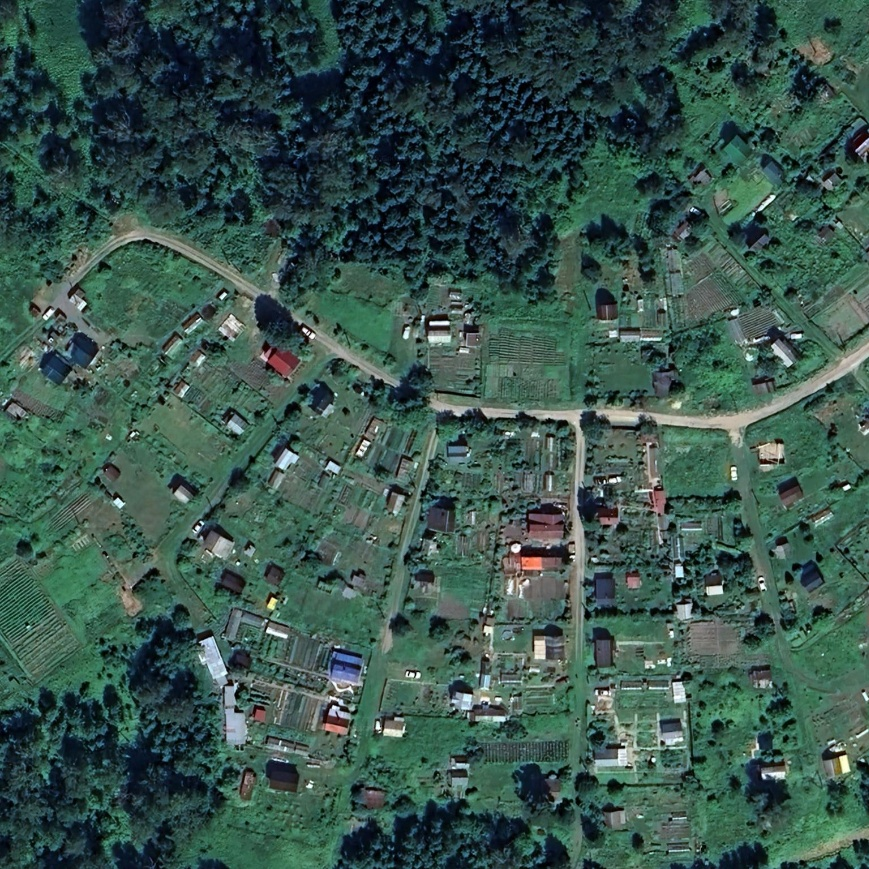
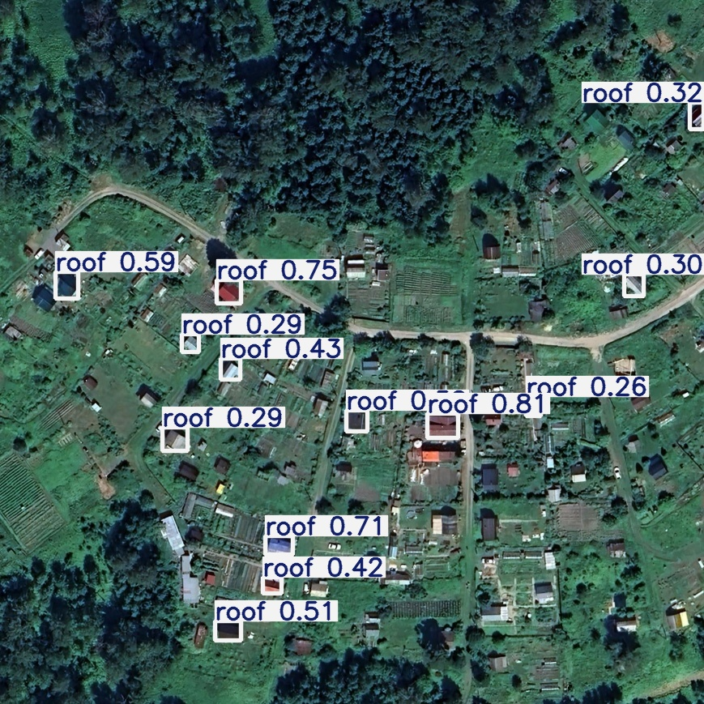
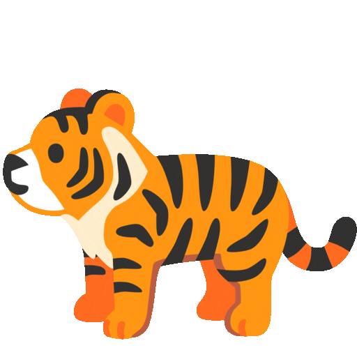

<h1 
    align="center">Hi there, I'm Pavel 
    
</h1>

<h3 align="center">
    Computer Vision & Mashine Learning Engineer
</h3>
<h3>
    

        
    

</h3>

## Models Zoo
<!-- CLASSIFICATION -->

Classification  [TO DO]

<table>
    <tr>
        <td>  </td>
        <td>  </td>
    </tr>
</table>

<table>
    <thead>
        <tr>
            <th scope="col" rowspan="1">Model</th>
            <th scope="col" colspan="1">PyTorch</th>
            <th scope="col" colspan="1">ONNX</th>
            <th scope="col" colspan="1">OpenVino</th>
            <th scope="col" colspan="1">RK3588</th>
        </tr>
    </thead>
    <tr>
        <th><a href="models_zoo/classification/resnet50">ResNet50</a></th>
        <th>-</th><th>-</th><th>-</th><th>-</th>
    </tr>
        <tr>
        <th><a href="models_zoo/classification/EfficientNetV2">EfficientNetV2</a></th>
        <th>-</th><th>-</th><th>-</th><th>-</th>
    </tr>
</table>

<!-- OBJECT DET -->

Object Detection 

<table>
    <tr>
        <td>  </td>
        <td>  </td>
    </tr>
</table>

<table>
    <thead>
        <tr>
            <th scope="col" rowspan="1">Model</th>
            <th scope="col" colspan="1">PyTorch</th>
            <th scope="col" colspan="1">ONNX</th>
            <th scope="col" colspan="1">OpenVino</th>
            <th scope="col" colspan="1">RK3588</th>
        </tr>
    </thead>
    <tr>
        <th><a href="models_zoo/object_detection/yolov8">YOLOv8</a></th>
        <th>+</th><th>+</th><th>+</th><th>+</th>
    </tr>
</table>

<!-- SEGMENT -->

Segmentation  [TO DO] 
 

<table>
    <tr>
        <td>  </td>
        <td>  </td>
    </tr>
</table>

<table>
    <thead>
        <tr>
            <th scope="col" rowspan="1">Model</th>
            <th scope="col" colspan="1">PyTorch</th>
            <th scope="col" colspan="1">ONNX</th>
            <th scope="col" colspan="1">OpenVino</th>
            <th scope="col" colspan="1">RK3588</th>
        </tr>
    </thead>
    <tr>
        <th><a href="models_zoo/segmentation/Unet">UNet</a></th>
        <th>-</th><th>-</th><th>-</th><th>-</th>
    </tr>
    <tr>
        <th><a href="models_zoo/segmentation/pidnet">PIDNet</a></th>
        <th>-</th><th>-</th><th>-</th><th>-</th>
    </tr>
        <tr>
        <th><a href="models_zoo/segmentation/OneFormer">OneFormer</a></th>
        <th>-</th><th>-</th><th>-</th><th>-</th>
    </tr>
</table>

<!-- POSE -->

Pose Estimation  [TO DO]

<!-- ACTION -->

Action Recognition  [TO DO]

## Deploing
You can [deploy](./deployment/) your models to `onnx`, `openvino` and `rknn` format