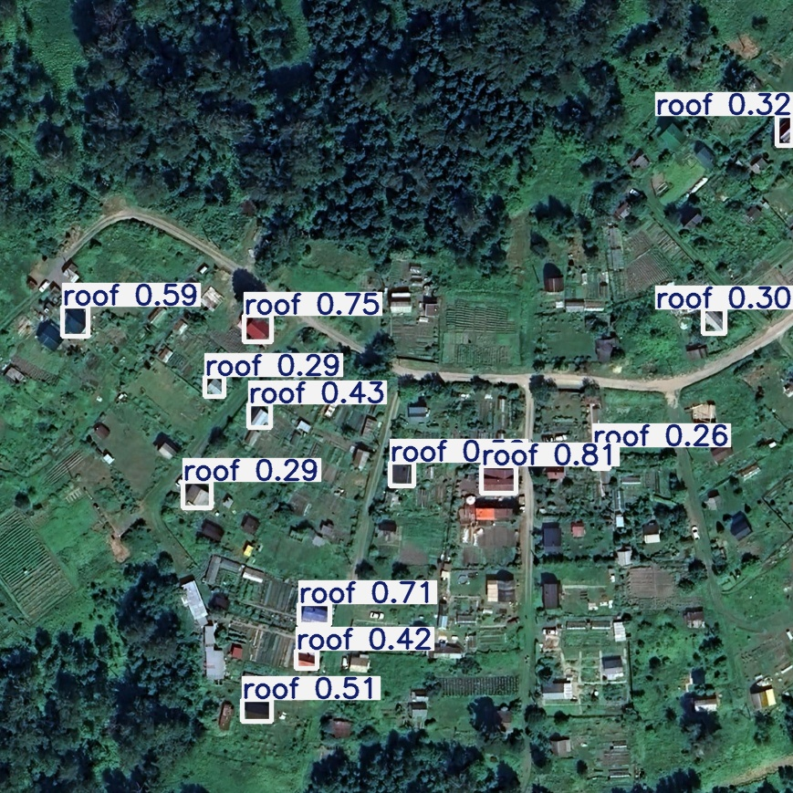

<h1 align="center">
    This directory is dedicated to running, training and deploying the 
    <a 
        href="https://github.com/ultralytics/ultralytics"> YOLO 
    </a> 
    model
    
</h1>

<table align="center">
    <tr>
        <td>  </td>
        <td>  </td>
    </tr>
</table>

# 1. Install
## 1.1 Environment
```bash
conda create -n yolov8det python==3.12
conda activate yolov8det
```
## 1.2 Get Repo
```bash
pip install ultralytics
```

# 2. Get Started
Edit `cuda/inference.py` file: check path to your `weights` and your `image`.  
Run code:
```bash
python cuda/inference.py
```

# 3. Train
You need to edit the file `train/train.py` and run it.
```bash
python train/train.py
```

# 4. Deploy
To convert a model to one of the following formats, first install the required [dependencies](../../../deployment/README.md). Then follow these steps:

## 4.1 ONNX
### Get ONNX weights
```
cd onnx

# If you haven't activated it yet
conda activate yolov8det

# Edit and run export.py
python export.py
```

### Install environment 
```
# You can install a clean environment 
# or use one that has already been created
conda create -n onnx python==3.12
conda activate onnx

# Install requirements
pip install -r requirements.txt
```
### Run
```
# Edit and run predict.py
python predict.py
```

## 4.2 RKNN
Go to "rknn" environment if it has been created.

### Special install
Install ultralytics_yolov8 special for converting pt -> onnx (optimized for rknn).

Clone repo
```
git clone https://github.com/airockchip/ultralytics_yolov8
```
Go to cloned directory
```
cd ultralytics_yolov8
```
Install as package
```
pip install -e .
```

#### Edit file
If you want specify a custom batch and image size when exporting.
```
nano ultralytics/engine/exporter.py
```
in `Exporter.export_rknn` method:
```
torch.onnx.export(
    self.model,
    self.im[0:self.args.batch,:,:,:],
    ...
)
```


### Convert model to .rknn
#### 4.2.1. Convert pt to onnx
```
cd rknn
# Edit and run deploy2onnx.py
python deploy2onnx.py
```
Check the input size when exporting the model. If necessary, change batch_size parameter in ultralytics/cfg/default.yaml to any value.

You should get ***9 outputs***. Check model.onnx in netron.app.

#### 4.2.2. Convert onnx to rknn
```
# Clone repo
git clone https://github.com/airockchip/rknn_model_zoo

# Go to directory with converter
cd rknn_model_zoo/examples/yolov8/python

# Edit `convert.py` (optional)
DATASET_PATH = "path/to/dataset.txt"
DEFAULT_RKNN_PATH = "path/to/model.rknn"

# Run converter
python convert.py <path-to-onnx-model>/yolov8n.onnx rk3588 i8 ../model/yolov8n.rknn
```
If the model has issues or warnings in convertation process, you can change opset version from 12 to 17 or 19, depending on PyTorch version. Currently, RKNN==2.1.0 recommends opset 19.
#### 4.2.3. Save and send it to Orange Pi

#### 4.2.4. Fast Start on RKNN
```
git clone https://github.com/Applied-Deep-Learning-Lab/rk3588-yolov8.git
cd rk3588-yolov8
python main.py 

# This correct for video
# If you need check image, you need edit main.py and base.py 
```

#### Check NPU utilization
```
watch sudo cat /sys/kernel/debug/rknpu/load
```

## 4.3 OpenVINO
```
cd openvino

pip install -r requirements.txt

# Export weights
ovc your_model_file.onnx

# Edit and run predict.py
python predict.py
```

# 5. Metrics
`CPU desktop - Intel Core i9-14900HX`  
`GPU desktop - RTX 4070 mobile`  
`RKNN platform - RK3588 (Orange-Pi 16GB)`  

<style>
td, th {
   border: 2px solid;
}
</style>

## 5.1 Performance, FPS
Without batching  
Size: `256x256` pxls
<table>
  <tr>
    <th>Model</th>
    <th>CPU (torch)</th>
    <th>GPU (torch)</th>
    <th>CPU (openvino)</th>
    <th>CPU (onnx)</th>
    <th>GPU (onnx)</th>
    <th>CPU (orange, torch)</th>
    <th>NPU (orange, int) </th>
    <th>NPU (orange, fp) </th>
  </tr>
  <tr>
    <td>yolov8n</td>
    <td>87</td>
    <td>140</td>
    <td>95</td>
    <td>83</td>
    <td>120</td>
    <td>2.5</td>
    <td>65</td>
    <td>58</td>
  </tr>
  <tr>
    <td>yolov8m</td>
    <td>33</td>
    <td>112</td>
    <td>21</td>
    <td>37</td>
    <td>95</td>
    <td>0.76</td>
    <td>38</td>
    <td>21</td>
  </tr>
</table>

## 5.2 Correctness
`map50`, `map50_95` for validation data

<table>
    <thead>
        <tr>
            <th scope="col" rowspan="2">Model</th>
            <th scope="col" colspan="2">torch</th>
            <th scope="col" colspan="2">onnx</th>
            <th scope="col" colspan="2">rknn_i8</th>
            <th scope="col" colspan="2">rknn_fp</th>
            <th scope="col" colspan="2">openvino</th>
        </tr>
        <tr>
            <th scope="col">map50</th>
            <th scope="col">map50_95</th>
            <th scope="col">map50</th>
            <th scope="col">map50_95</th>
            <th scope="col">map50</th>
            <th scope="col">map50_95</th>
            <th scope="col">map50</th>
            <th scope="col">map50_95</th>
            <th scope="col">map50</th>
            <th scope="col">map50_95</th>
        </tr>
    </thead>
  <tr>
    <td>yolov8n</td>
    <td>0.517</td>
    <td>0.255</td>
    <td>0.539</td>
    <td>0.287</td>
    <td>0.512</td>
    <td>0.272</td>
    <td>0.525</td>
    <td>0.28</td>
    <td>0.568</td>
    <td>0.318</td>
  </tr>
  <tr>
    <td>yolov8m</td>
    <td>0.527</td>
    <td>0.292</td>
    <td>0.545</td>
    <td>0.298</td>
    <td>N/A</td>
    <td>N/A</td>
    <td>N/A</td>
    <td>N/A</td>
    <td>0.558</td>
    <td>0.318</td>
  </tr>
</table>